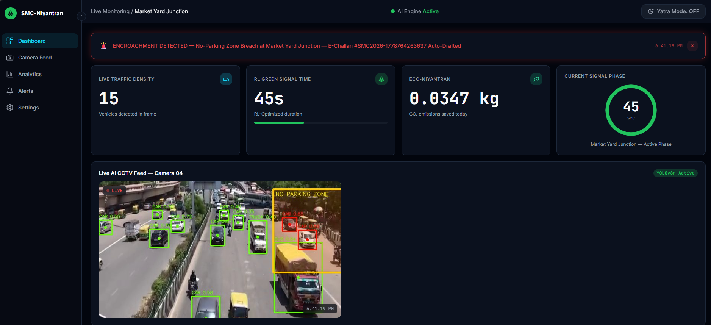
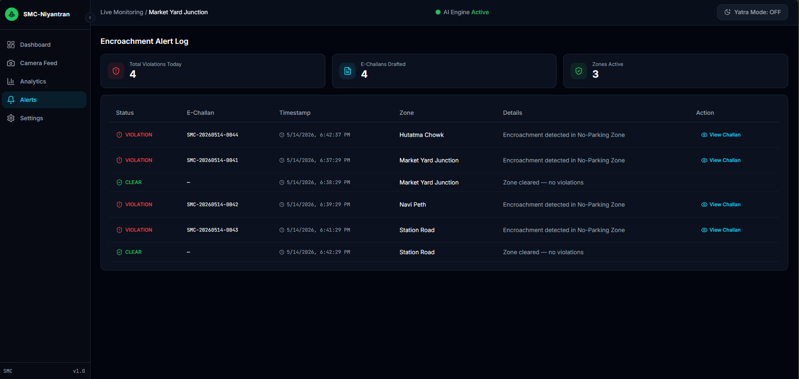
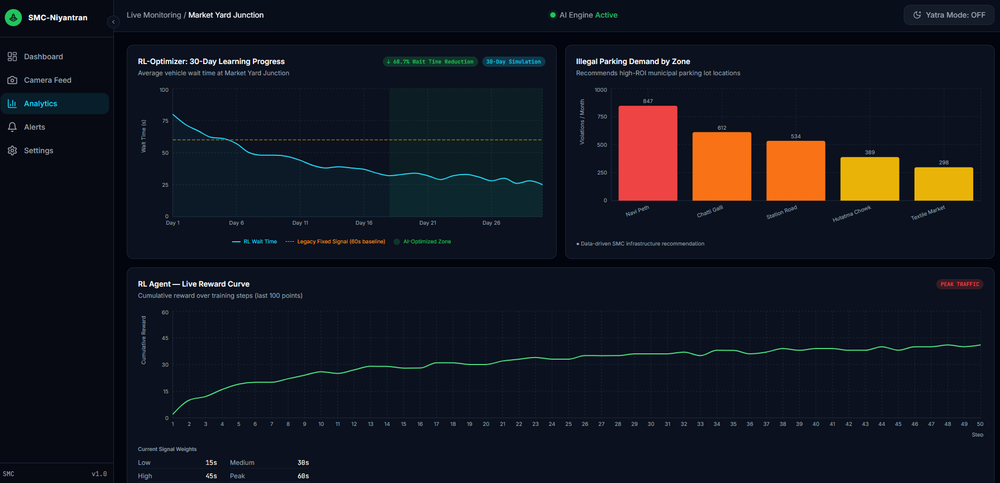
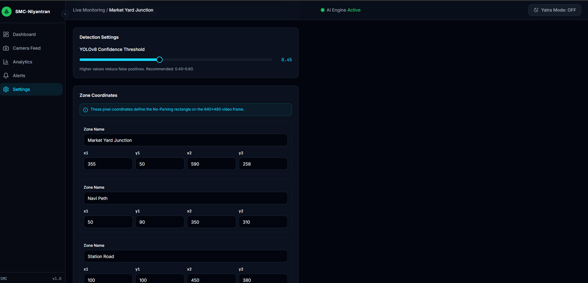

# SMC-Niyantran 🚦
> AI-powered Smart City Traffic Platform for Solapur Municipal Corporation

[](https://opensource.org/licenses/MIT)
[](https://fastapi.tiangolo.com/)
[](https://reactjs.org/)
[](https://github.com/ultralytics/ultralytics)

## 1. Project Title and Description
**SMC-Niyantran (Smart Traffic)** is a decentralized, AI-driven traffic intelligence platform designed for the Solapur Municipal Corporation (SMC) under the Samved Hackathon. The system utilizes existing CCTV infrastructure and edge computing (Raspberry Pi 4) to eliminate the inefficiencies of fixed 60-second traffic signals, saving commute time, fuel, and reducing carbon emissions. It features automatic encroachment detection, dynamic RL-based signal optimization, auto E-Challan generation, and a specialized one-click "Yatra Mode" for managing massive pilgrim crowds during the Siddheshwar Yatra.

## 2. Features
- **Dynamic RL Optimizer:** Replaces fixed timers with adaptive signal control based on real-time vehicle density (reducing wait times by ~68.7%).
- **Virtual Geofencing & Encroachment Detection:** Automatically detects vehicles parked in unauthorized zones using YOLOv8 bounding boxes.
- **Auto E-Challan Generation:** Generates real-time infraction logs with unique challan IDs in under 40ms with zero manual enforcement.
- **Yatra Mode (Emergency Override):** One-click fail-safe to prioritize pilgrim and emergency vehicle flow during major festivals.
- **Eco-Niyantran (Carbon Calculator):** Tracks cumulative CO2 emissions saved by reducing vehicle idle times (up to 4.2 tonnes CO2/day citywide).
- **AI Live Assistant:** Integrated Gemini 1.5 Flash for context-grounded queries and parking/vehicle analysis.

## 3. Tech Stack
- **AI / Computer Vision:** YOLOv8n, OpenCV 4.9, NumPy, PyTorch 2.0 (CPU only)
- **Backend:** Python, FastAPI, Uvicorn
- **Frontend:** React 18, Vite, TypeScript, Tailwind CSS, shadcn/ui, Recharts
- **LLM / Generative AI:** Google Gemini 1.5 Flash (Context-grounded)
- **Hardware Profile:** Raspberry Pi 4 (Edge device), existing RTSP/CCTV IP cameras

## 4. Installation Instructions

### Prerequisites
- Python 3.9+
- Node.js 18+ & npm
- Basic C/C++ build tools (for OpenCV dependencies)

### Backend Setup
```bash
# 1. Navigate to the backend directory
cd backend

# 2. Create and activate a virtual environment
python -m venv venv
source venv/bin/activate      # On Windows: venv\Scripts\activate

# 3. Install dependencies
pip install -r requirements.txt

# 4. Provide a video feed
# Place your CCTV feed as 'traffic_feed.mp4' in the backend/ directory
# (If missing, the system will automatically run a synthetic demo feed)
```

### Frontend Setup
```bash
# 1. Navigate to the frontend directory
cd frontend2

# 2. Install dependencies
npm install
```

## 5. Usage

### Running the Backend
```bash
cd backend
source venv/bin/activate
uvicorn main:app --host 0.0.0.0 --port 8000 --reload
```
*The API will be live at `http://localhost:8000`. Auto-generated Swagger docs available at `http://localhost:8000/docs`.*

### Running the Frontend
```bash
cd frontend2
npm run dev
```
*The React Dashboard will be accessible at `http://localhost:8080` (or the port specified by Vite, typically `5173`).*

## 6. Project Structure
```text
Smart Traffic/
├── backend/                  # FastAPI Backend & AI Engine
│   ├── main.py               # Core application and video processing threads
│   ├── requirements.txt      # Python dependencies
│   ├── traffic_feed.mp4      # Live CCTV or demo footage
│   └── yolov8n.pt            # Pre-trained YOLOv8 Nano weights
│
├── frontend2/                # React Vite Application
│   ├── src/                  # React components, pages, and hooks
│   ├── public/               # Static assets
│   ├── package.json          # Node dependencies
│   ├── tailwind.config.ts    # Tailwind UI configurations
│   └── components.json       # shadcn/ui component definitions
│
└── README.md                 # Project Documentation
```

## 7. API Documentation
The FastAPI backend serves several key endpoints for the React dashboard:

| Method | Endpoint | Description |
|--------|----------|-------------|
| `GET`  | `/api/video-feed` | Streams live processed MJPEG video frames with YOLO bounding boxes. |
| `GET`  | `/api/traffic-data` | Polled for real-time metrics (vehicle counts, active alerts, green times). |
| `GET`  | `/api/alert-log` | Retrieves history of encroachment violations and auto-generated E-Challans. |
| `GET`  | `/api/carbon-log` | Fetches a 30-day rolling array of CO2 metrics and RL learning efficiency. |
| `GET`  | `/api/system-stats` | Provides system FPS, frame counts, and hardware uptime metrics. |
| `POST` | `/api/settings` | Hot-reloads configuration (e.g., Yatra Mode, zone coordinates, confidence). |

*Sample response for `/api/traffic-data`:*
```json
{
  "vehicle_count": 12,
  "encroachment_alert": true,
  "dynamic_green_time": 36,
  "carbon_saved_kg": 4.2,
  "yatra_mode": false,
  "fps": 24.5,
  "backend_status": "live"
}
```

## 8. Screenshots

### Dashboard

*Figure 1: Main React Dashboard showing live CCTV feed, YOLOv8 detections, and dynamic RL timers.*

### Alert Logs

*Figure 2: Real-time Encroachment Detection and Auto E-Challan Drafting.*

### Analytics

*Figure 3: Eco-Niyantran 30-Day Carbon Emission Reduction Analytics.*

### Settings

*Figure 4: Hot-reloadable Settings Panel and Yatra Mode activation.*

*(Note: Create a `screenshots` folder in the repository root and place your actual screenshots using these filenames.)*

## 9. Configuration
- **Backend Configuration:** The application hot-reloads settings directly via the `/api/settings` endpoint. Initial default parameters like `BASELINE_GREEN`, `CARBON_PER_VEH_SEC`, and `ZONE` coordinates are hardcoded at the top of `backend/main.py` but can be dynamically overridden by the frontend.
- **Frontend Configuration:** The frontend communicates directly with `http://localhost:8000`. Ensure proxy settings in Vite or `.env` files are updated if you deploy the backend on a remote server.

## 10. Contributing Guidelines
1. Fork the repository.
2. Create a feature branch (`git checkout -b feature/AmazingFeature`).
3. Commit your changes (`git commit -m 'Add some AmazingFeature'`).
4. Push to the branch (`git push origin feature/AmazingFeature`).
5. Open a Pull Request.

## 11. License
This project is open-source and distributed under the **MIT License**.

## 12. Author / Credits
**Team Name:** VYOMAN
